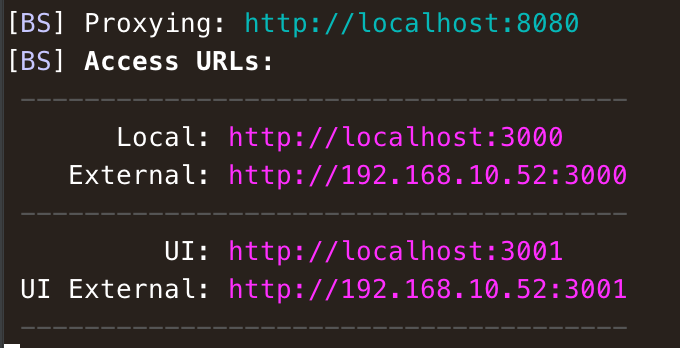

# Fancy-ass Job-title Generator

<p align="center">
  
</p>

Generate yourself a [fancy-ass](https://ville.io/fancyass-job-title-generator/) job title :moneybag:

Built with:
* [Vue.js Starter Template](https://github.com/villeristi/vue.js-starter-template)

## Demo
Navigate to [https://ville.io/fancyass-job-title-generator/](https://ville.io/fancyass-job-title-generator/) and see the awesomeness IRL :bowtie:

## Getting started

1. Be sure you have [Yarn](https://yarnpkg.com/en/docs/install) installed globally.
2. Clone the repo & run `yarn` from the project root

## Available commands

```sh
yarn start
```

Runs the Webpack module-bundler, starts watching for changes & launches the BrowserSync server to [http://localhost:3000](http://localhost:3000) (it's possible to change the port from `package.json` config-section). Uses [Webpack Dashboard](https://github.com/FormidableLabs/webpack-dashboard)

**Note!** Webpack handles all the reloading stuff while BrowserSync just proxies the default webpack-port (`8080`) giving the possibility to connect to dev-server from multiple devices:



```sh
yarn lint:js
```

Lints javascript-files inside `/src` directory

```sh
yarn build
```

Runs the webpack module-bundler with production-settings (compress etc.) and builds the project to `/build` directory.
